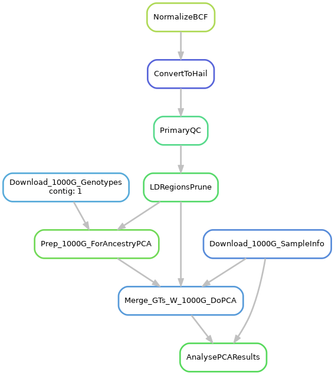
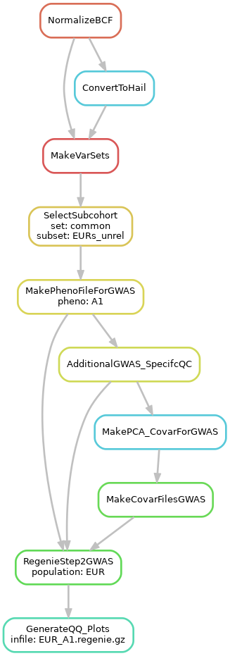
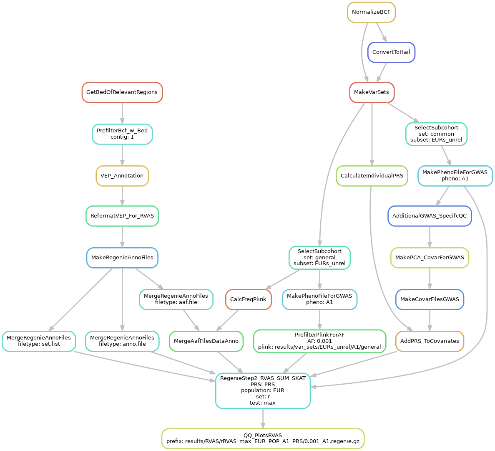

# DeCOI_WGS

Pipeline for QC, GWAS and gene-based collapsing within the DeCOI WGS cohort (1220 individuals). Rules for ROH-analysis and gene-set based analyses are also included. This repository is for documentary purposes and the pipeline will not run out of the box - e.g. adjustments are needed for the local compute environment and not all inpute files (e.g. genotype files, phenotype files, annotation sources) are provided.

## Setup
This pipeline was run on a compute cluster running Linux (CentOS Linux 7) and slurm 22.05.6. Miniconda3 was manually installed (https://docs.conda.io/en/latest/miniconda.html).
The setup is quiet complex, due to the use of the slurm scheduler and the use of Apache Spark. The setup was done in the following way:

Two conda environments were manually created: 
- an environment running snakemake-7.3.7:
```
	conda create --name snakemake7 -c bioconda snakemake=7.3.7
	# for letting snakemake submit jobs to slurm a profile file with the default settings for snakemake was used.
	# for documentation you can find the file I used in "config/snakemake_slurm_profile/config.yaml"
	# you would need to modify it to have e.g. the correct default partition and account. Then you would move it to snakemakes config directory:
	mkdir -p ~/.config/snakemake/slurm
	cp config/snakemake_slurm_profile/config.yaml ~/.config/snakemake/slurm
	# afterwards you should be able to execute "snakemake --profile slurm"; then each rule that is executed should be submitted as an individual slurm job. Resource requirements can be specified in each snakemake-rule (see file workflow/Snakefile). 
```
- an environment for running hail / Apache Spark:
Note that this environment is being created to be able to set up a Apache Spark cluster on top of slurm which can then be used by hail. This will probably need some testing. If running hail on a single node is enough, you could simply install hail via conda (e.g. just run the first two commands from below and then run "conda install -c bioconda hail"). You could then set the variable cluster to "no" in config/config.yaml.

```
	conda env update --file env/spark_from_history.yaml
	conda activate spark
	mkdir -p ~/scratch/spark
	cd ~/scratch/spark
	wget https://archive.apache.org/dist/spark/spark-3.1.1/spark-3.1.1-bin-hadoop3.2.tgz
	tar zxvf spark-3.1.1-bin-hadoop3.2.tgz
	git clone https://github.com/hail-is/hail.git
	cd hail/hail
	make install-on-cluster HAIL_COMPILE_NATIVES=1 SCALA_VERSION=2.12.13 SPARK_VERSION=3.1.1
	pip install pyspark==3.1.1
	
	# now manually modify the file "workflow/scripts/spark_submit_command.sh" as indicated within the file.
	# also adjust the last 5 variables within config/config.yaml
	
```

The pipeline could now be tested by running 
```
conda activate snakemake7
snakemake -np
```
The whole pipeline was executing by using the file "run.sh"; this file would also need adjustments (as indicated in the file):
```
conda activate snakemake7
sbatch run.sh
```

Here are the DAGs of some analyses that were conducted - the names of the rules are indicated.

Population-PCA:



GWAS:



RVAS:




## Inputs
Not all input files that were used for the pipeline are included in this repository due to privacy issues or file-size. The following files are missing:
- genotype data / cohort bcf, which was produced by glnexus. The path ("input_vcf") can be set in the file config/config.yaml.
- fasta file of the reference genome (here hg38). The path ("fasta") can be set in the file config/config.yaml.
- Data of the 1000 genomes project; You only need to provide a folder; there is a snakemake-rule ("download_1000G_genotypes") to download the data. The path ("location_1000G") can be set in the file config/config.yaml.
- Phenotype files are not included due to privacy issues; see resources folder for a short description of those files (for reference only).
- several annotation sources for VEP are not included, which were placed in the folder indicated under the variable "database_dir" in the config file: <br>
"gnomad.exomes.r2.1.1.sites.liftover_grch38.vcf.bgz" source: https://gnomad.broadinstitute.org/downloads#v2-liftover , <br>
"dbNSFP4.1a_hg38.gz" source: https://sites.google.com/site/jpopgen/dbNSFP - the prepared for VEP/the dbNSFP plugin of VEP as described in https://github.com/Ensembl/VEP_plugins/blob/release/102/dbNSFP.pm <br>
"spliceai_scores_sorted.hg38.vcf.gz" source: downloaded from https://basespace.illumina.com/s/otSPW8hnhaZR , then sorted by chrom:pos and bgziped/indexed <br>


